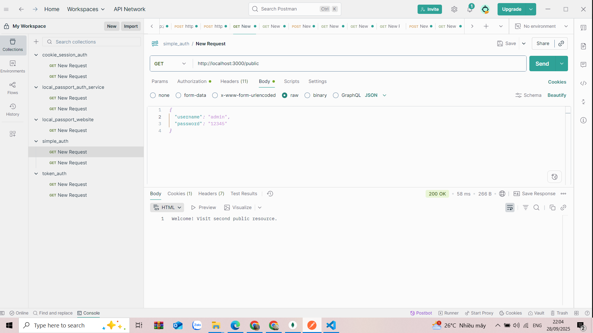
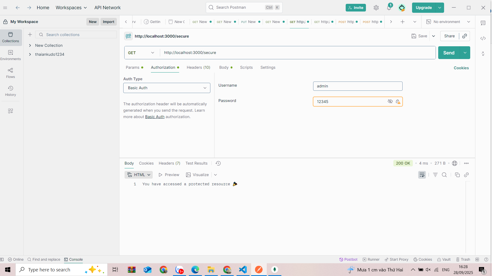
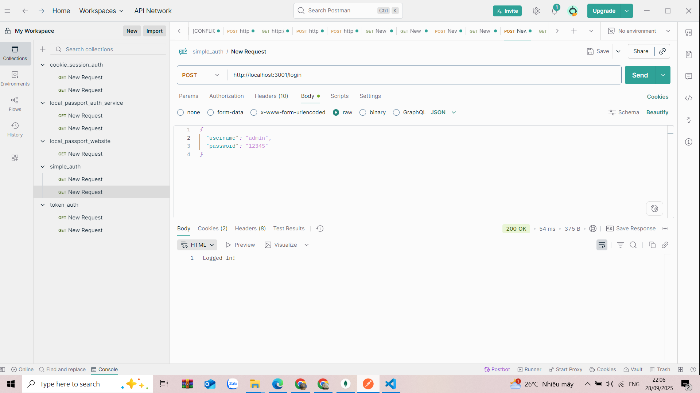
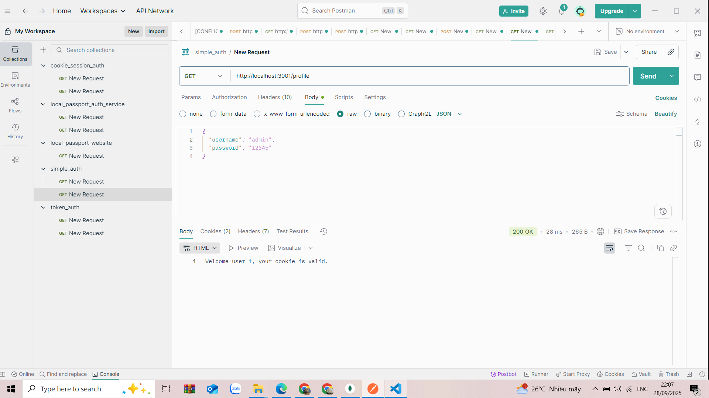
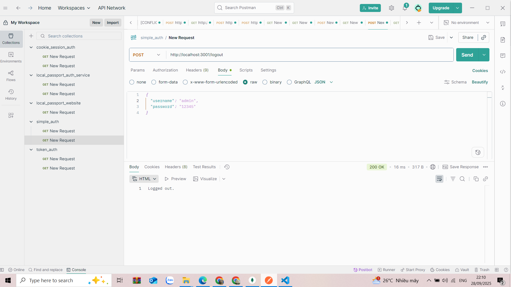
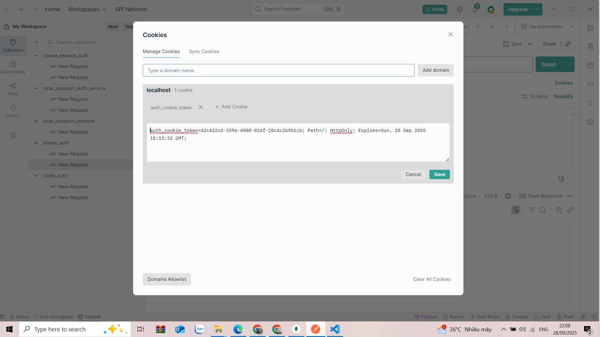
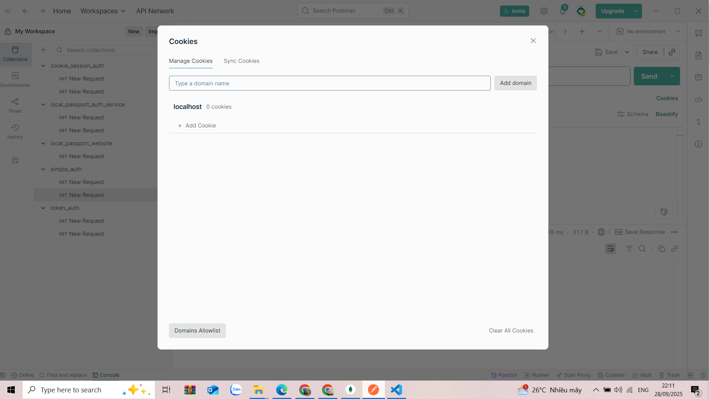
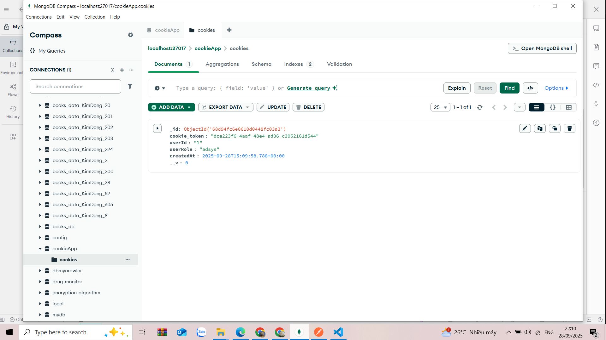
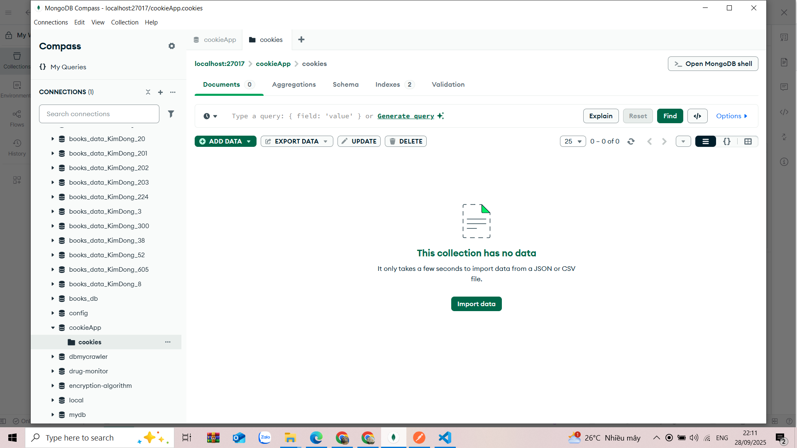

# Simple Authentication & Cookie Authentication

## 🧪 Cách Test Bằng Postman

1. **Chạy server**
   - Với Basic Auth: `node server.js` (port 3000)
   - Với Cookie Auth: `node app.js` (port 3001)

2. **Test Basic Authentication**
   - **Public route**: Gửi GET `http://localhost:3000/public` → Không cần auth.
   - **Secure route**: Gửi GET `http://localhost:3000/secure`
     - Thêm Header `Authorization: Basic YWRtaW46MTIzNDU=`  
       (đây là `admin:12345` encode base64).  
     - Nếu sai user/pass → báo lỗi 403.

3. **Test Cookie Authentication**
   - **Login**: POST `http://localhost:3001/login`
     - Body (JSON):
       ```json
       { "username": "admin", "password": "12345" }
       ```
     - Trả về cookie `auth_cookie_token` + lưu vào MongoDB.
   - **Profile**: GET `http://localhost:3001/profile`
     - Dùng cookie từ bước login.
   - **Logout**: POST `http://localhost:3001/logout`
     - Xóa cookie ở trình duyệt và trong MongoDB.

---

## 📸 Kết Quả Test (Screenshots)

### 🔹 Basic Auth
- Public route:  
  

- Secure route (có auth):  
  

- Login:  
  

- Profile:  
  

- Logout:  
  

### 🔹 Cookie Auth + MongoDB
- Login (Postman):  
  

- Logout (Postman):  
  

- MongoDB sau login:  
  

- MongoDB sau logout:  
  
